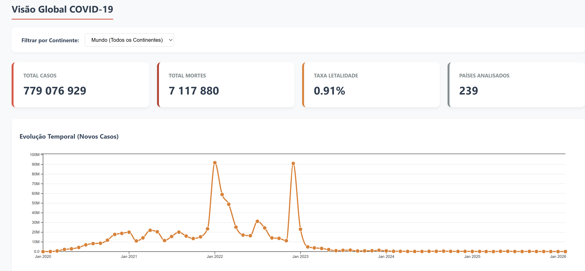
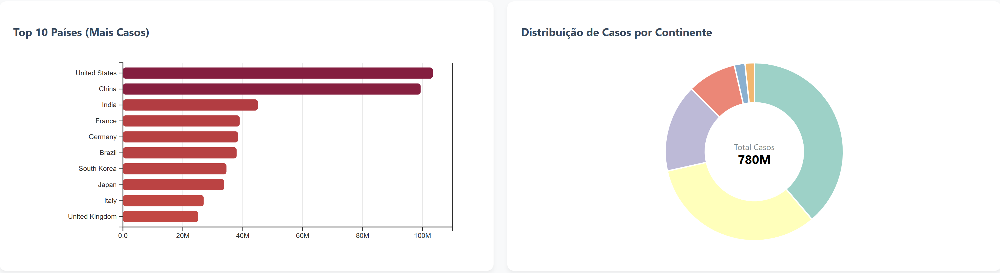
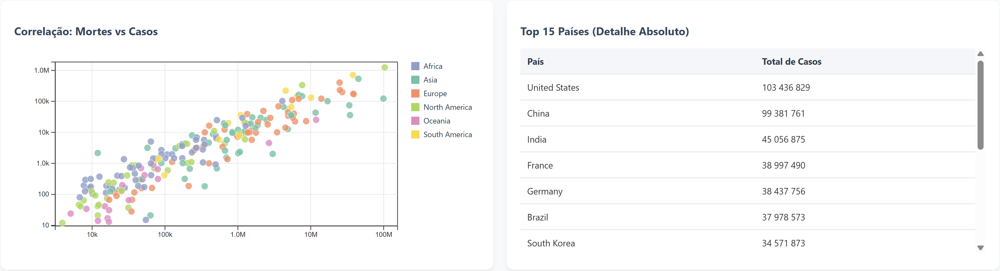
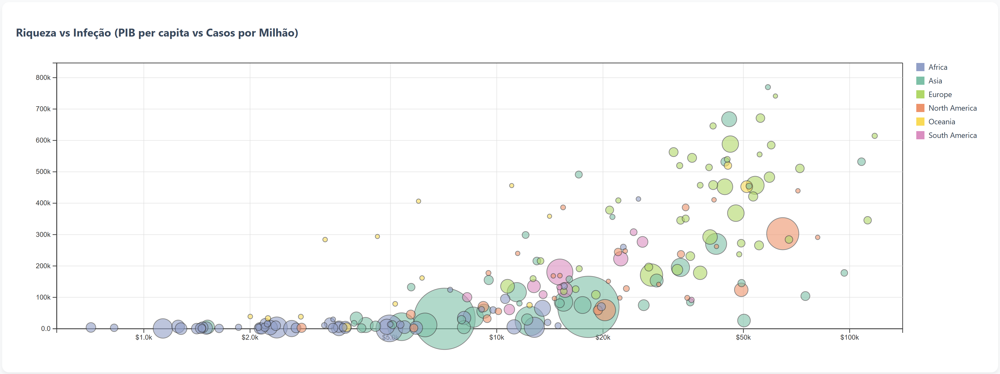
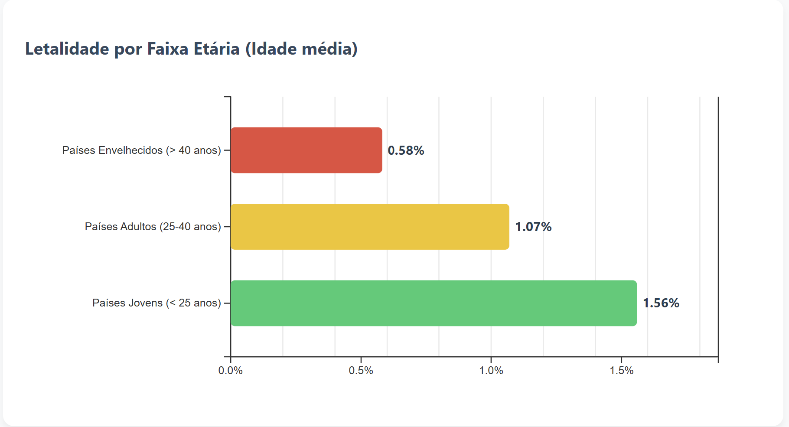

# SVDC

# 🦠 Dashboard Analítico: Visão Global COVID-19

  
*(Clique no botão acima para aceder ao dashboard interativo)*

---

## 1. Passos de Transformação do Dataset
O dataset original sofreu um processo de limpeza e redução estrutural no Excel para otimizar o tempo de carregamento no navegador, e um tratamento dinâmico no D3.js:

* **Remoção de Agregados:** Eliminação de linhas que não correspondiam a países reais (ex: "World", "Europe", "High income"), filtrando pelas células vazias na coluna `continent`.
* **Redução de Dimensionalidade:** Das mais de 60 colunas originais, retive apenas 7 cruciais para a nossa análise: `country`, `date`, `new_cases`, `new_deaths`, `population`, `gdp_per_capita` e `median_age`.
* **Formatação Delimitadora e Temporal:** Ajuste do separador para ponto e vírgula (`;`) e uniformização das datas para o padrão `DD/MM/YYYY`.
* **Limpeza Dinâmica (D3.js):** O algoritmo Javascript foi programado para detetar falhas de reporte (células vazias) em dias específicos e preenchê-las assumindo o valor `0`, garantindo que os gráficos de evolução temporal não sofrem quebras na renderização.

## 2. Objetivos Detalhados e *Insights*
O objetivo deste dashboard em D3.js não é apenas mostrar o volume da COVID-19, mas sim comunicar visualmente correlações ocultas entre a propagação da doença, a economia e a demografia.

Os principais *insights* a comunicar e a forma de os alcançar:

* **Mensagem 1: A gravidade real vs Volume absoluto.**
  * *Como alcançamos:* Uso de um Gráfico de Dispersão duplo-logarítmico (Mortes vs Casos). Isto permite comparar a verdadeira taxa de mortalidade e o sucesso na gestão da pandemia de cada país, retirando o "esmagamento visual" provocado por países gigantes como a Índia ou os EUA.
* **Mensagem 2: A riqueza protege contra a infeção?**
  * *Como alcançamos:* Cruzamento do PIB *per capita* com os Casos por Milhão através de um Gráfico de Bolhas. Aplicou-se uma escala logarítmica no Eixo X (Riqueza) para distribuir harmoniosamente os países e evidenciar se países mais ricos testaram/detetaram mais casos. O raio reflete a população.
* **Mensagem 3: O peso da demografia na letalidade.**
  * *Como alcançamos:* Através de uma técnica de *Binning* (agrupamento), categorizámos os países em 3 faixas etárias baseadas na sua idade média (< 25 anos, 25-40 anos, > 40 anos). O gráfico de barras resultante pondera o total real de mortes a dividir pelo total de casos de cada grupo estatístico, confirmando a correlação letal do vírus em populações envelhecidas.
* **Mensagem 4: Impacto geográfico e progressão temporal.**
  * *Como alcançamos:* Implementação de um Gráfico de Barras dinâmico (Top 10) suportado pelo método `.nice()` e um Gráfico de Linhas agregado por mês (`d3.timeMonth`) para suavizar o "ruído" diário. Todo o dashboard está interligado a um filtro global por Continente.

## 3. Como Reproduzir o Projeto Localmente
Caso não utilize a versão *Live* fornecida no topo deste documento, siga estes passos:
1. Clone este repositório para o seu computador.
2. Certifique-se de que os ficheiros `index.html`, `script.js` e `covid_data.csv` estão na mesma pasta.
3. Inicie um servidor HTTP local (ex: extensão *Live Server* do VS Code, ou `python -m http.server` no terminal) para contornar as restrições CORS de leitura de ficheiros locais.
4. Abra o `index.html` no seu navegador.

## 4. Resultados do Dashboard
Abaixo encontram-se capturas de ecrã das visualizações desenvolvidas:

 

